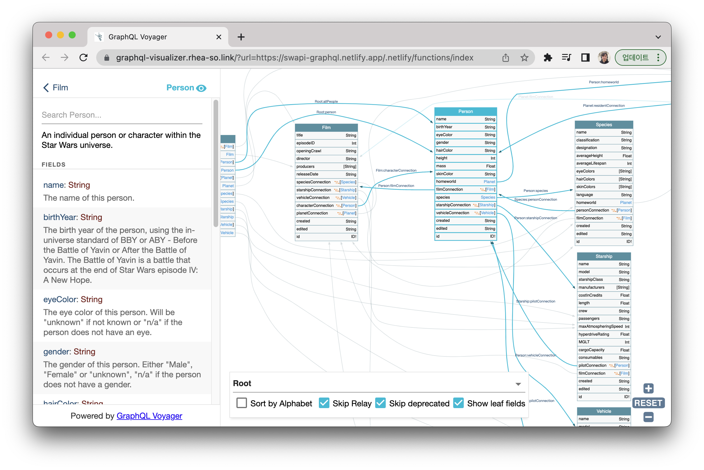

<h1 align="center">
  GraphQL Visualizer
</h1>

> This is a project to run [graphql-voyager](https://github.com/IvanGoncharov/graphql-voyager) standalone on the web without server setup.

## Quick Start

https://graphql-visualizer.rhea-so.link

## Example

https://graphql-visualizer.rhea-so.link/?url=https://swapi-graphql.netlify.app/.netlify/functions/index

## License

Project is [MIT licensed](./LICENSE).
