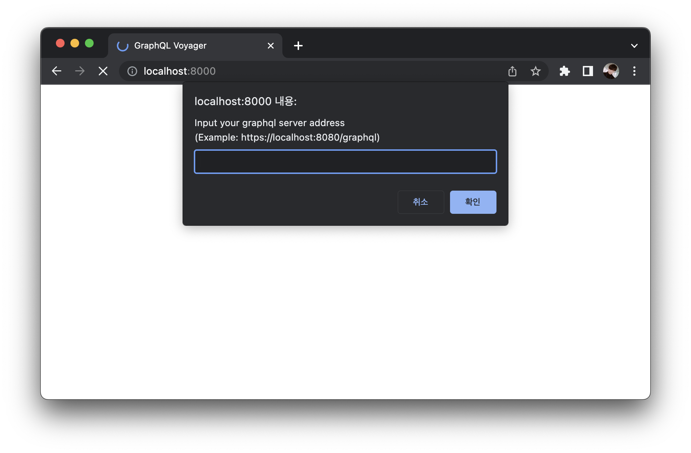
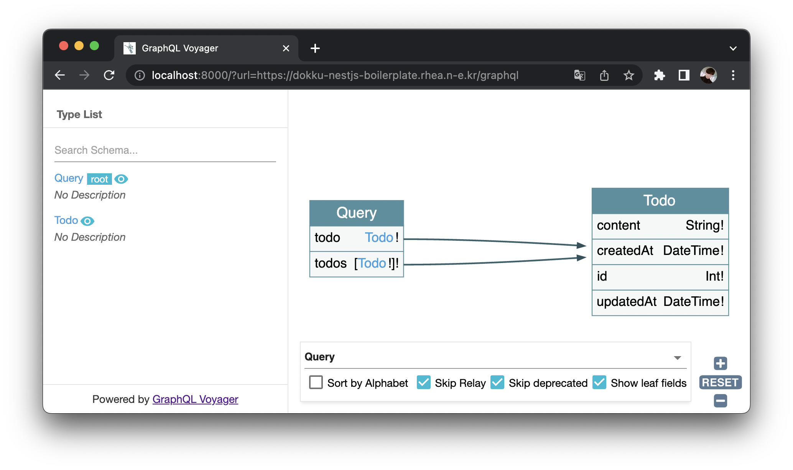

# GraphQL Voyager Web Standalone

<!-- Badges -->

This is a project to run [graphql-voyager](https://github.com/IvanGoncharov/graphql-voyager) standalone on the web without server setup.

## Features

## Quick Start

1. Open [this URL](https://rhea-so-lab.github.io/graphql-schema-visualizer)
2. Input your graphql server address

3. Enjoy

> [Example](https://rhea-so-lab.github.io/graphql-schema-visualizer/?url=https://swapi-graphql.netlify.app/.netlify/functions/index)

## Question

For questions and support please use the official [Discord channel](https://discord.gg/g4RTffnTa5). The issue list of this repo is exclusively for bug reports and feature requests.

## License

Project is [MIT licensed](./LICENSE).
